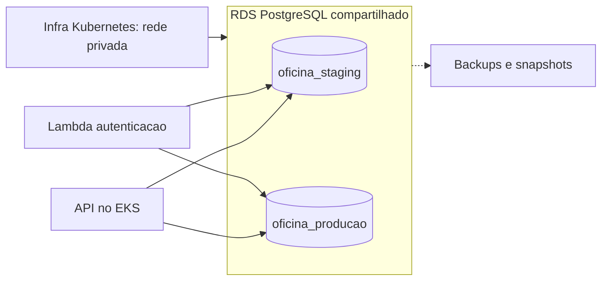

# Oficina Infra Database

Base de infraestrutura do banco gerenciado do Tech Challenge da oficina.
A proposta e usar RDS PostgreSQL, preservando o motor e as migrations da
[aplicacao principal](https://github.com/Venomouus/Oficina-Mecanica).

## Estado deste PR

Implementado:
- Variaveis Terraform validadas e planejamento de configuracao do banco.
- Exemplo de staging/develop e producao/master, sem segredos.
- Pipeline de fmt, init sem backend e validate.
- Diagramas de arquitetura planejada e modelo relacional atual resumido.

Ainda pendente:
- Provider AWS, instancia RDS, rede de acesso, backups e segredos reais.
- Criacao dos bancos, roles e grants e execucao das migrations.
- Alteracoes do modelo para status de cliente e historico de OS.
- Estado remoto, OIDC, CD dos ambientes e teste de restauracao.

Nao existem recursos provisionaveis nesta base. Configuracoes de backup,
criptografia e protecao contra exclusao sao planejadas, ainda sem efeito na AWS.

## Tecnologias

Terraform e GitHub Actions na preparacao. RDS PostgreSQL e o destino planejado.
EF Core e Npgsql permanecem no repositorio da API, junto com suas migrations.

## Estrutura

```text
.github/workflows/ci.yml
infra/
  versions.tf
  variables.tf
  main.tf
  outputs.tf
  terraform.tfvars.example
  README.md
docs/
  arquitetura.md
  modelo-relacional.md
```

## Arquitetura planejada



API e Lambda terao identidades e configuracoes distintas por ambiente.
A proposta economica e uma instancia compartilhada com bancos e roles separados.
O exemplo single-AZ nao oferece failover Multi-AZ e compartilha o dominio de falha.

[Arquitetura e acessos planejados](docs/arquitetura.md).
[Modelo relacional e justificativa PostgreSQL](docs/modelo-relacional.md).

## Validar localmente

Requer Terraform >= 1.6 e < 2.0; a pipeline usa 1.15.8.

```powershell
terraform -chdir=infra fmt -check -recursive
terraform -chdir=infra init -backend=false -input=false
terraform -chdir=infra validate
```

Nao sao necessarias credenciais AWS para essa validacao. O CI nao verifica
conexao ao banco nem disponibilidade real de classes/versoes na conta.

`infra/terraform.tfvars.example` contem os dois ambientes e configuracoes
planejadas de armazenamento e backups. Nao coloque senhas reais nesse arquivo.

Dockerfile nao se aplica: este repositorio nao executa a aplicacao nem
containeriza RDS. O PostgreSQL local via Docker Compose continua na API.

## CI e branches

Fluxo: `develop -> feature/config-ci -> PR para develop -> PR para master`.

A pipeline executa em PRs destinados a develop/master, pushes nessas branches
e manualmente. Em feature, o CI automatico e iniciado ao abrir/atualizar o PR.

O unico check deste repositorio e **validate-terraform**.
Depois da primeira execucao bem-sucedida, configure protecao em develop e master:
- Exigir PR e validate-terraform aprovado.
- Exigir resolucao de conversas e impedir bypass.
- Bloquear force push e exclusao.
- Para trabalho individual, deixar Require approvals desmarcado.

Nao selecione checks da API ou do serverless que nao existem neste repositorio.

## Deploy futuro

| Ambiente GitHub | Branch | Banco logico planejado |
|---|---|---|
| staging | develop | oficina_staging |
| producao | master | oficina_producao |

Mantenha `DEPLOY_ENABLED=false` como variavel de repositorio.

Este PR possui somente CI; ainda nao ha job de deploy consumindo a variavel.
Muda-la para true agora nao cria RDS nem executa migrations.

Para habilitar deploy:
1. Provisionar a rede pelo repositorio Kubernetes.
2. Implementar os recursos RDS, acesso privado e gestao de segredos.
3. Definir um estado compartilhado para a instancia e ownership das configuracoes
   por ambiente, com locking e execucao serializada.
4. Preparar backend remoto, OIDC e plan autenticado.
5. Implementar bootstrap de bancos/roles e migrations controladas pela API.
6. Configurar CD automatico para as duas branches, condicionado a DEPLOY_ENABLED.
7. Testar conexao, isolamento dos acessos, backups e restauracao na AWS.

[Dependencias, validacao e remocao futura](infra/README.md).

## APIs relacionadas

Este repositorio nao expoe API de negocio.

- [Swagger e instrucoes da API principal](https://github.com/Venomouus/Oficina-Mecanica#collection--swagger).
- [Contratos planejados de autenticacao](https://github.com/Venomouus/Oficina-serverless/blob/master/docs/contratos.md).
- Swagger local: http://localhost:8080/swagger, depois de iniciar a API com Docker.
- Endpoints e evidencias AWS: pendentes de implementacao e deploy.

## Repositorios relacionados

- [Aplicacao principal](https://github.com/Venomouus/Oficina-Mecanica)
- [Serverless](https://github.com/Venomouus/Oficina-serverless)
- [Infra Kubernetes](https://github.com/Venomouus/Oficina-infra-kubernetes)
