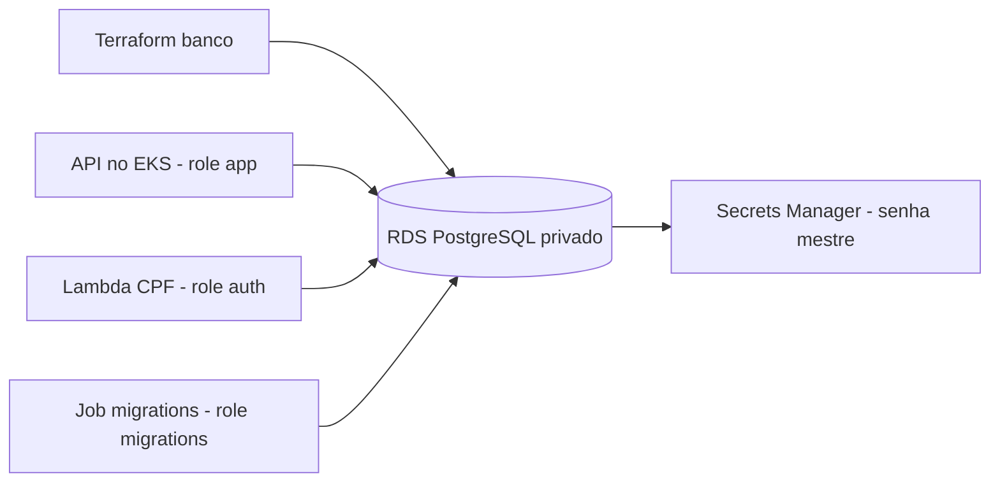

# Oficina — infraestrutura do banco

Terraform da instancia RDS PostgreSQL compartilhada do laboratorio. Consome a rede do repositorio Oficina-infra-kubernetes; nao cria VPC nem aplica migrations da API.

## Estado da entrega

Implementado em codigo e testado com AWS simulada:

- RDS PostgreSQL 16, gp3 criptografado, armazenamento inicial de 20 GiB e autoscaling limitado a 100 GiB.
- Subnet group em pelo menos duas AZs, com verificacao de VPC e rotas isoladas.
- PostgreSQL privado: TCP 5432 permitido somente ao SG da aplicacao e aos SGs Lambda de staging/producao.
- Senha mestre gerenciada pelo RDS no Secrets Manager; Terraform nao recebe nem consulta seu valor.
- TLS obrigatorio, backups automaticos de sete dias, snapshot final obrigatorio e protecao contra exclusao.
- Exportacao dos logs PostgreSQL/upgrade ao CloudWatch, com retencao de sete dias.
- Backend S3 parcial, provider fixado no lockfile e CI de formatacao, validacao e 12 testes sem AWS real.

RDS PostgreSQL 16.13 provisionado no Academy: db.t4g.micro, 20 GiB (limite 30), Single-AZ e backup de um dia para economia. Bancos logicos staging/producao e roles app/auth/migrations preparados por Jobs privados; migrations reais executadas.

O workflow `academy-deploy.yml` faz deploy de develop/master no runner Windows autorizado (label academy). Requer PC/Docker ativos e credenciais temporarias Academy validas. O codigo compartilhado de deploy fica em [Oficina-Mecanica/academy](https://github.com/Venomouus/Oficina-Mecanica/tree/master/academy). Evidencias e limites finais estao no [pacote de entrega](https://github.com/Venomouus/Oficina-Mecanica/tree/master/docs/entrega).

## Validacao local sem AWS

No terminal PowerShell, a partir da raiz:

```powershell
terraform -chdir=infra fmt -check -recursive
terraform -chdir=infra init -backend=false -input=false -lockfile=readonly
terraform -chdir=infra validate -no-color
terraform -chdir=infra test -no-color
```

Requisitos: Terraform 1.15.8 (versao da CI) e acesso ao registry para instalar o provider. Nao exige Docker, API local, banco local ou credenciais AWS. Os testes usam `mock_provider "aws"`; o `command = apply` dentro deles e simulado.

Para provisionar posteriormente, siga [infra/README.md](infra/README.md). Decisoes e contratos estao em [arquitetura](docs/arquitetura.md), [modelo relacional](docs/modelo-relacional.md) e [ADR do RDS](docs/adr-rds-compartilhado.md).

## Fluxo Git

`feature/infra-rds → develop → master`, por pull requests, exigindo o check `validate-terraform`. Ha uma unica infraestrutura compartilhada e um unico state do banco; o mapeamento develop/staging e master/producao descreve os bancos logicos, nao duas instancias criadas por branches diferentes.


## Bootstrap dos bancos e permissoes

[bootstrap/README.md](bootstrap/README.md) descreve a preparacao por ambiente:
prepare, migrations EF com credencial propria, grants e verificacao dos logins.
A API recebe DML; autenticacao recebe somente tres colunas de Clientes. Runtime
nao altera schema/historico de migrations nem acessa o banco do outro ambiente.

Terraform prepara quatro containers de segredos app/migrations (sem valores);
o segredo auth continua pertencendo ao serverless. O output runtime_secret_arns
identifica seus destinos. O provisionamento e preenchimento reais continuam pendentes.

A CI preserva o check validate-terraform e acrescenta Python/PostgreSQL descartavel
e SQL real de migrations da API em revisao fixa. Sao 12 testes Terraform simulados
e 14 testes de bootstrap/permissoes, sem credenciais AWS. Localmente, sem informar
BOOTSTRAP_MIGRATIONS_SQL, o teste adicional do EF fica skipped.

## Diagrama e contrato das APIs



[Postman das APIs integradas](https://github.com/Venomouus/Oficina-Mecanica/blob/master/docs/entrega/Oficina-AWS.postman_collection.json).
