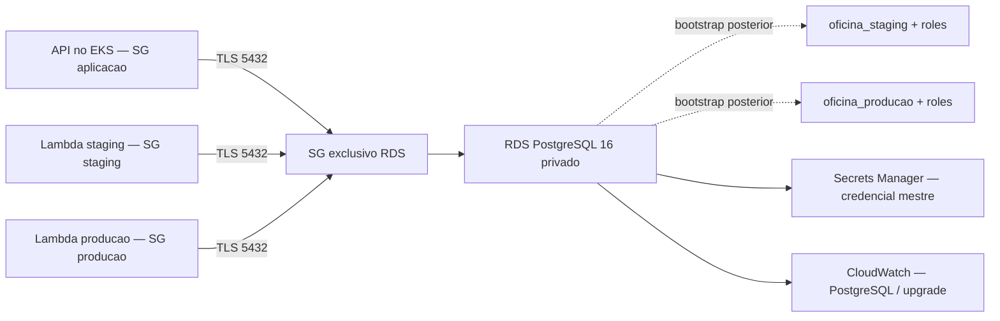

# Arquitetura do banco na AWS

Uma instancia RDS PostgreSQL 16 privada atende os ambientes staging/develop e producao/master do laboratorio. A infraestrutura e compartilhada; o isolamento entre ambientes depende de bancos, roles, grants e credenciais distintos, a serem criados pelo bootstrap.

## Limites de responsabilidade

| Repositorio | Responsabilidade |
|---|---|
| Oficina-infra-kubernetes | VPC, rotas, sub-redes isoladas, EKS, SGs Lambda e regras HTTPS |
| Oficina-infra-database | RDS, subnet group, SG PostgreSQL, regras Lambda→RDS, parametros TLS, backups e logs do banco |
| Oficina-Mecanica | Modelo EF, migrations, operacoes da oficina e autorizacao dos endpoints |
| Oficina-serverless | Autenticacao CPF/JWT e futuras integracoes de notificacao |

O contrato de entrada `platform` usa IDs explicitos, sem ler o state completo de outro repositorio. O output `database` tem versao 1 e fornece conectividade e nomes planejados. O output separado `bootstrap_secret_arn` e metadado para a tarefa administrativa de bootstrap.

## Isolamento e disponibilidade

A instancia nao possui acesso publico. Suas sub-redes possuem apenas rotas locais; o subnet group precisa de pelo menos duas AZs mesmo no modo Single-AZ. Somente os tres SGs clientes recebem ingress TCP 5432; nao ha regra de CIDR aberto.

Esses SGs autorizam conectividade com a instancia inteira. Eles nao separam bancos por ambiente nem substituem autorizacao SQL. O SG da aplicacao tambem e compartilhado no EKS; grants, credenciais e politicas dos workloads sao necessarios.

Single-AZ e uma concessao do laboratorio e nao oferece failover Multi-AZ. A opcao Multi-AZ esta disponivel, mas a instancia ainda compartilha capacidade e janela de manutencao entre ambientes. Veja a [decisao arquitetural](adr-rds-compartilhado.md).

## Seguranca e evidencias pendentes

A criptografia de storage usa a chave gerenciada pela AWS por padrao. O mestre e gerenciado pelo RDS no Secrets Manager, sem senha fornecida ao Terraform. TLS e exigido no servidor; clientes devem verificar certificado e hostname.

Ainda precisam ser demonstrados: bootstrap com privilegios minimos, negacao de acesso entre ambientes, conexao API/Lambda, migrations separadas, restauracao de backup e operacao na AWS. Logs RDS nao substituem logs estruturados, metricas de negocio, alertas e tracing da aplicacao.
