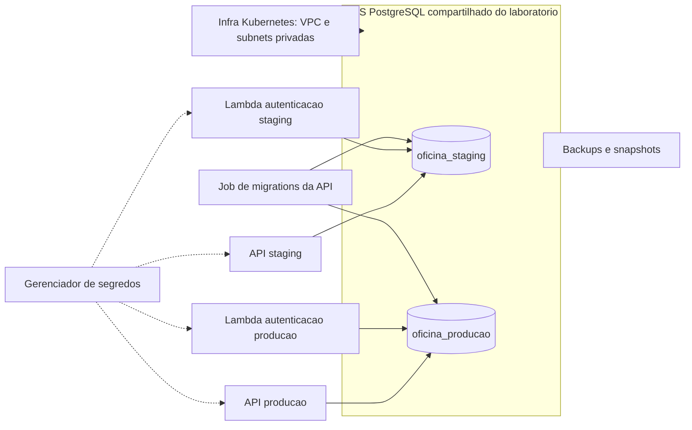

# Arquitetura planejada do banco

Os recursos AWS deste documento ainda nao estao implementados.

## Separacao por ambiente

Uma instancia compartilhada reduz a quantidade de recursos do laboratorio.
Bancos e roles distintos limitam o acesso logico, mas compartilham capacidade,
manutencao e falhas da instancia. A branch master representa producao da
demonstracao; isso nao declara isolamento corporativo completo.

A configuracao de exemplo usa single-AZ como concessao de custo. Para a
arquitetura de alta disponibilidade, avaliar Multi-AZ e testar recuperacao.
O [RDS Multi-AZ](https://docs.aws.amazon.com/AmazonRDS/latest/UserGuide/Concepts.MultiAZSingleStandby.html)
mantem uma instancia de espera em outra zona para failover. Isso ainda nao
esta ativado neste projeto.

## Acessos planejados

| Identidade | Permissoes previstas |
|---|---|
| API do ambiente | Leitura e escrita nos dados de negocio do proprio banco |
| Lambda autenticacao | Leitura limitada ao identificador, documento e status do cliente |
| Executor de migrations | Alteracoes de schema no banco do ambiente |
| Administracao/bootstrap | Criacao controlada de bancos, roles e grants |

As credenciais administrativas nao devem ser usadas pela API ou pela Lambda.
O bootstrap deve rever os privilegios PUBLIC, grants, acesso aos schemas e
privilegios padrao dos objetos criados pelas migrations. Roles com nomes
diferentes, sozinhas, nao garantem isolamento.

Senhas e strings de conexao reais nao pertencem aos arquivos de exemplo.
Gerenciamento de segredos, TLS e rotacao serao implementados na integracao.

## Backups e recuperacao

A retencao proposta e de sete dias. O RDS oferece backups automaticos e
recuperacao dentro da janela de retencao, conforme sua configuracao.
[Documentacao de backups](https://docs.aws.amazon.com/AmazonRDS/latest/UserGuide/USER_WorkingWithAutomatedBackups.html).

A entrega deve incluir teste de restauracao com leitura dos dados restaurados.
Alta disponibilidade e backup atendem problemas diferentes: failover nao
substitui recuperacao de dados removidos incorretamente.

## Ownership

- Infra Kubernetes: rede e cluster.
- Este repositorio: servico RDS, regras de acesso e configuracao de backups.
- API: schema, migrations, indices e regras transacionais.
- Serverless: adaptador de consulta do cliente e tratamento de falhas.

A Lambda depende da migration que acrescentara o status do cliente; o modelo
atual da API ainda nao possui esse campo.

## Provas pendentes na nuvem

- Banco privado acessivel pela API e Lambda.
- Isolamento dos acessos de staging e producao.
- Migrations executadas uma vez de forma controlada.
- Backups configurados e restauracao testada.
- Metricas de conexoes, armazenamento e desempenho.
- Deploy automatico, URLs/documentacao relacionadas e evidencias de CI/CD.
