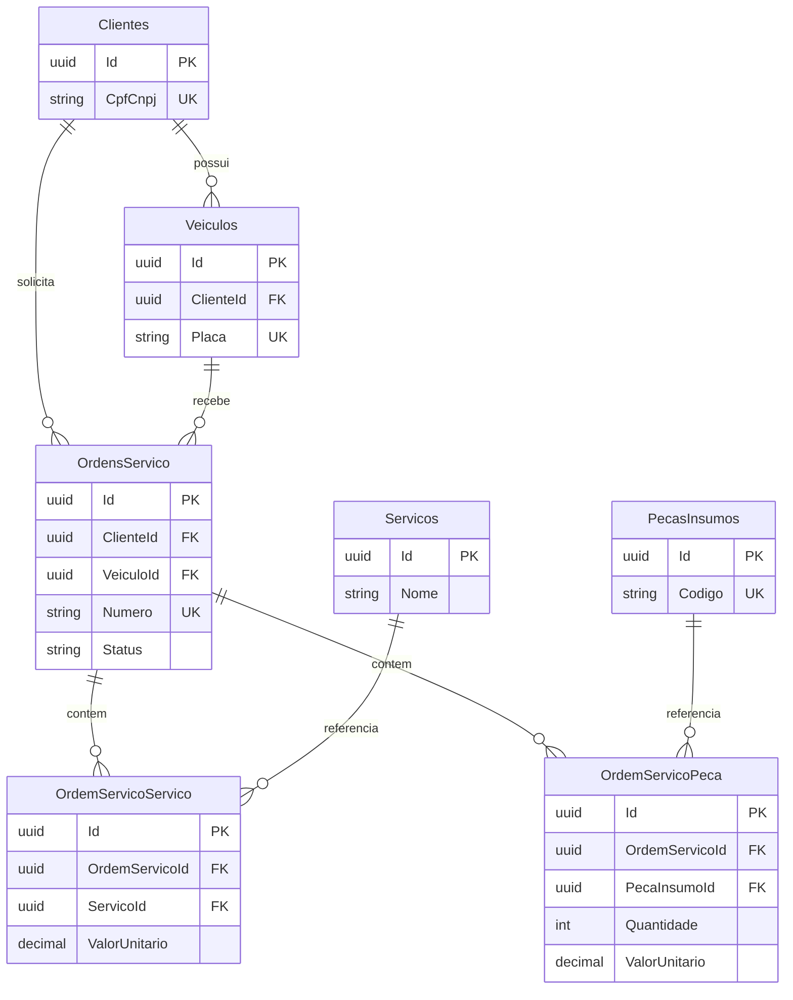

# Modelo relacional e escolha do banco

## Justificativa

Manter PostgreSQL aproveita o EF Core/Npgsql e as migrations que ja existem na
aplicacao. Clientes, veiculos, ordens, servicos e pecas possuem relacionamentos
explicitos; unicidade de documento/placa/numero e integridade referencial sao
necessidades centrais do dominio.

PostgreSQL suporta chaves primarias, estrangeiras e restricoes de unicidade
adequadas a essas regras. [Documentacao de constraints](https://www.postgresql.org/docs/16/ddl-constraints.html).
RDS e a proposta para operar esse mesmo motor como banco gerenciado. A escolha
preserva o modelo existente; configuracao gerenciada e validacao de desempenho
ainda precisam ser implementadas.

## Modelo atual resumido

Baseado no mapeamento
[OficinaDbContext](https://github.com/Venomouus/Oficina-Mecanica/blob/master/Oficina.Infrastructure/Persistence/OficinaDbContext.cs).
O diagrama resume chaves e relacionamentos, nao todas as colunas.

Um cliente pode ter varios veiculos e ordens. Cada OS referencia um cliente e
um veiculo; a coerencia entre o proprietario do veiculo e o cliente da OS
tambem precisa ser garantida pelo fluxo da aplicacao.

As tabelas OrdemServicoServico e OrdemServicoPeca representam os itens da OS.
Seus nomes e valores unitarios preservam os dados usados no orcamento mesmo
quando o cadastro de servicos/pecas muda. O mapeamento restringe exclusao de
cadastros referenciados e permite exclusao em cascata dos itens ao excluir
a OS; politicas de retencao do historico devem ser revisadas antes da producao.

## Ajustes ainda pendentes na API

- Status ativo/inativo do cliente, necessario para autenticacao.
- Historico das transicoes de status, com inicio/fim para os dashboards.
- Indices das consultas por status/data e cliente, avaliados com consultas reais.
- Concorrencia nas operacoes de estoque e geracao do numero de OS.
- Constraints de dominio, como quantidades validas, conforme as regras definitivas.
- Execucao controlada das migrations fora da inicializacao de cada replica.

O historico proposto tera relacao 1:N com a OS e sera atualizado na mesma
transacao da mudanca de status. Os periodos de diagnostico, execucao e
finalizacao precisam de definicao consistente antes de calcular as metricas.

Esses ajustes exigem codigo, migrations e testes no repositorio da API.
Este PR nao altera o schema nem conclui a modelagem exigida para a entrega.
